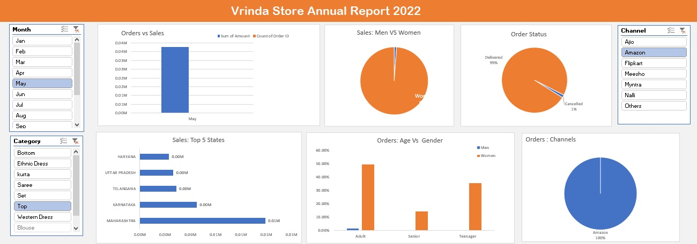
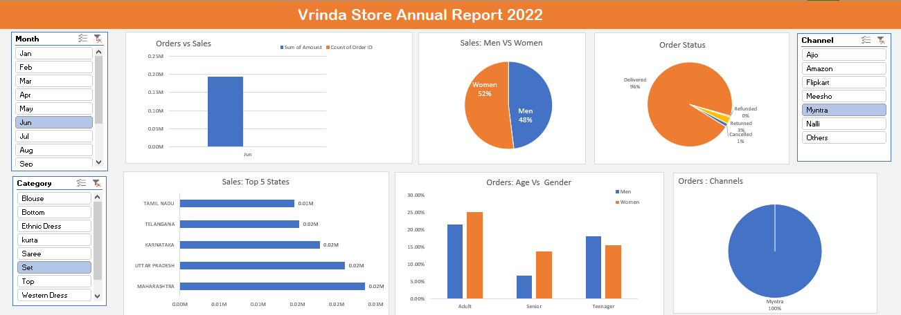
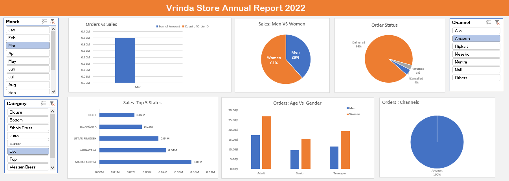
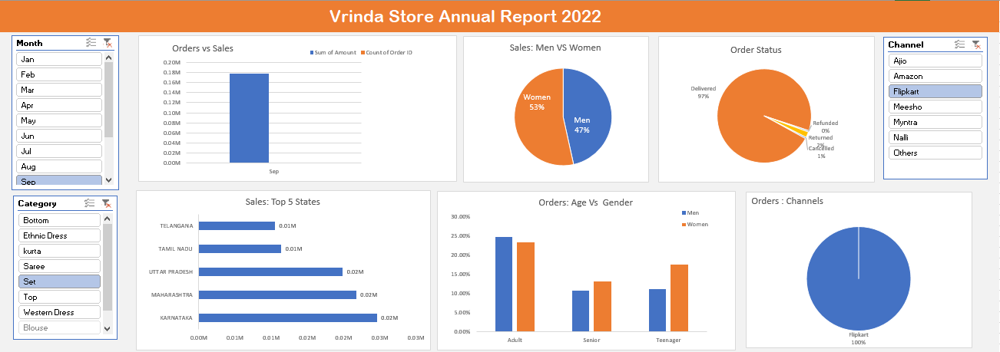

# Vrinda Store Sales Analysis Dashboard (Excel Project)

## Project Overview

Vrinda Store wanted to understand its customer behavior and sales performance in order to increase revenue in 2023.

This project analyzes the **2022 sales dataset** and builds an **interactive dashboard using Microsoft Excel** to identify trends in sales, customer demographics, product performance, and order channels.

The main objective of this project is to generate actionable insights that help Vrinda Store make better business decisions and improve future sales strategies.

---

# Business Problem

Vrinda Store wanted to create an **annual sales report for 2022** so that management could:

* Understand customer behavior
* Identify top-performing products
* Analyze sales channels
* Improve marketing strategy
* Increase revenue in 2023

---

# Tools & Skills Used

* Microsoft Excel
* Data Cleaning
* Pivot Tables
* Pivot Charts
* Data Visualization
* Business Analysis
* Dashboard Design

---

# Dataset Description

The dataset contains sales transactions of Vrinda Store for the year **2022**.

Key columns include:

* Order ID
* Order Date
* Product Category
* Sales Amount
* Quantity
* Customer Gender
* Age Group
* City / State
* Sales Channel (Amazon, Flipkart, Myntra)
* Order Status

This dataset was used to analyze **sales patterns, customer demographics, and product performance**.

---

# Project Folder Structure

```
vrinda-store-analysis
│
├── dataset
│   └── vrinda_store_data.xlsx
│
├── dashboard
│   └── vrinda_dashboard.xlsx
│
├── images
│   ├── one.png
│   ├── two.png
│   ├── three.png
│   └── four.png
│
└── README.md
```

---

Business Questions Answered by the Dashboard
1. Orders vs Sales

Question:
How do the total number of orders compare with the total sales amount?

Insight:
This chart compares the number of orders and total revenue generated during the selected period. It helps understand whether higher orders result in higher revenue.

Chart Type: Bar Chart

2. Sales: Men vs Women

Question:
Which gender contributes more to overall sales?

Insight:
The chart shows that women customers contribute a slightly higher percentage of sales compared to men. This indicates that women are a key target segment for the store.

Chart Type: Pie Chart

3. Order Status Distribution

Question:
What percentage of orders are delivered, returned, refunded, or cancelled?

Insight:
Most orders are successfully delivered, while only a small percentage are cancelled or returned. This indicates good order fulfillment performance.

Chart Type: Pie Chart

4. Top 5 States by Sales

Question:
Which states generate the highest revenue?

Insight:
The chart highlights the top-performing states contributing the most sales revenue, helping the company focus marketing and logistics efforts in these regions.

Chart Type: Horizontal Bar Chart

5. Orders by Age Group and Gender

Question:
Which age group and gender place the most orders?

Insight:
Adults represent the largest customer segment, and the comparison between men and women helps identify target demographics.

Chart Type: Clustered Column Chart

6. Orders by Sales Channel

Question:
Which platform generates the most orders?

Insight:
The chart shows which online platforms (Amazon, Flipkart, Myntra, etc.) contribute the most sales orders, helping identify the most effective sales channels.

Chart Type: Pie Chart
---

# Dashboard Features

The interactive Excel dashboard allows users to filter sales data by:

* Month
* Product Category
* Sales Channel

Key visualizations included in the dashboard:

* Orders vs Sales Trend
* Sales by Gender
* Order Status Distribution
* Top 5 States by Sales
* Orders by Age Group
* Orders by Sales Channel

These visualizations help management quickly understand **sales patterns and customer behavior**.

---

# Key Insights

The analysis reveals several important insights:

* Women customers contribute a majority of the total sales.
* The **Adult age group (30–49 years)** places the highest number of orders.
* **Amazon, Myntra, and Flipkart** are the top-performing sales channels.
* **Maharashtra and Karnataka** are among the highest revenue-generating states.
* Most orders are successfully delivered, indicating strong order fulfillment performance.

---

# Business Recommendations

Based on the insights, Vrinda Store can improve sales by:

1. Increasing marketing campaigns targeting female customers.
2. Expanding marketing efforts in top-performing states.
3. Strengthening partnerships with major sales channels such as Amazon and Flipkart.
4. Promoting top-selling products during festive seasons.
5. Optimizing inventory management for high-demand categories.

---

# Dashboard Preview

## Dashboard 1



## Dashboard 2



## Dashboard 3



## Dashboard 4



---

# How to Use the Dashboard

1. Download the Excel dashboard file.
2. Open the file using Microsoft Excel.
3. Use the slicers to filter data by month, category, or channel.
4. Explore the charts to analyze sales performance and trends.

---

# Project Outcome

This project demonstrates the ability to:

* Clean and analyze large datasets
* Build interactive dashboards
* Translate business questions into data-driven insights
* Communicate results through effective visualizations

The analysis provides valuable insights that can help Vrinda Store improve its **sales strategy and decision-making for the upcoming year**.

---

# Author

**Keshav Potdar**
Aspiring Data Analyst | Excel | Data Analytics | Business Intelligence
